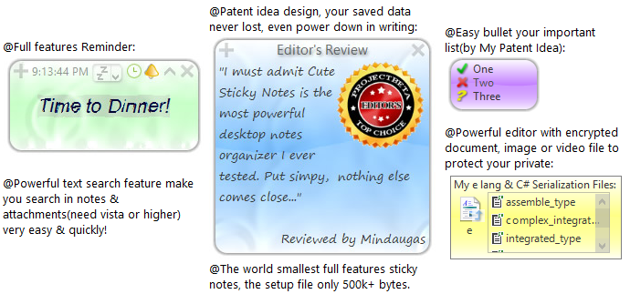

# Cute Sticky Notes
  
  
**If you don't realize what the meaning by below image, to ignore this webpage, qualified programmer must be first!**  
>*Of course there are many top programmers that opened their source code to people for free to build the key foundation of modern world today, but their name &lt;almost lost that only few professionals known it even me don't know, and they get unfair less paid in material and physicality> maybe forgot by people in tomorrow history, look at the ancient wonders in world you will realize it, this is why this project come here!*  
  
  

>*if can't see(from Edge etc.), click link above or open 'cute.png' from source list!*  
  
**T**his project only contain the binary file of Cute Sticky Notes App, the binary file is compiled by C#,  and this project is **only for qualify geeks**&lt;with his powerful friend **hacker**> to read the idea --
*`Show how to implement importants features with smallest code, e.g.:`*

1) **2D UI engine.** (for easily create your custom OS desktop&lt;windows system> or 'web' browser)
2) **Database & File System** (with fast read/write/compress/encrypt/search/&lt;recover from power lost in writing, *but if it over other fs, maybe will not work*> support, the fs protocol tell you the key tech about the network of files)  
3) **Data Struct Protocol** (as a universal computer data communicate protocol with fast load<*only read your want from disk to ram*>/compress/encrypt/search support. e.g. something like json/http(s) protocol maybe out of date someday, but this core idea will not.)
4) **Async** in old language that don't support.

http://cutestickynotes.com/

>*App maybe need **hack** to run:*  
>*because **virus**{some will infect C# object cause app delete user data file, some stop this app run} not due to this app,*  
>*if you work it out: the list of people&you(from country) using it currently can see from url: app-website/db*.

***The qualify geeks verified in this project will get a ticket**(`the image copy see source list, if you get high 3D resolution html5 webGL? funny version and tell me the correct meaning of figures, as a gift: my 'encrypt code backup'.'source code'<leaked> to welcome your join`) **to use a full features .o binary**(a OS.o almost without hardware code&lt;of course is fast than other OS your know> + 'close source IDE'.base.o) **for your custom OS** (`the client to 'close source developer network: be a programmer node in homework@net'`, if you don't want your hard work be stolen by thieves, and want earn more money to build&lt;with your qualify friends> your dream future IT world.)*  
>*  *the .o files for above is still under development: maybe one year or more == the time that you figure out this app and know the powerful people in this circle. the door only open once if you wait then door will not open again.*  
>*  ***remenber**: because **evil enjoy** to camouflage the innocent or good to **query wisdom**&lt;it's a weapon can rob(kill) you secretly by despicable evil>! **don't tell** any your intellectual property to anyone&lt;the good can solve by himself than read your or others wisdom>!*
